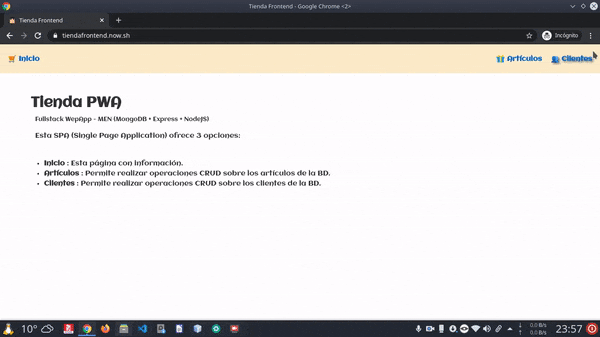

# Svelte - Mini tutorial

> **ESTE MINITUTORIAL ES UNA VERSIÓN RESUMIDA DEL FRONTEND DE ESTA APLICACIÓN**
> 
> A tener muy en cuenta:
>
> - Este minitutorial aún está en elaboración. La aplicación también.
> - No se explica la parte backend, sólo la parte frontend.
> - Mucho del código que aparece en este minitutorial está simplificado con fines didácticos.
> - Para ver todo el código, revisar el código fuente de este repositorio.


## Introducción

Actualmente (año 2020), en el mundo del desarrollo web se vive una efervescencia de nuevas tecnologías. 

Como base tenemos a los 3 pilares fundamentales:

- **HTML 5**
- **CSS 3**
- **Javascript (EcmaScript 6)**

Son lenguajes que todo desarrollador web debería conocer con cierta soltura.

Tanto HTML 5 como CSS 3 han crecido mucho y actualmente cada uno de estos estándares se organizada en distintas partes. 

En cuanto a Javascript, es a partir de 2015 (estándar ECMAScript 6), que  llegó con un montón de nuevas características después de muchos años de indefinición, cuando ha resurgido un gran interés por este lenguaje, ya no sólo para desarrollo de scripts web, sino también como lenguaje a tener en cuenta para el desarrollo de aplicaciones. Esta tendencia se ha visto reforzada por dos circunstancias:

- El uso de Javascript fuera del navegador, a través del entorno de ejecución **node.js**.
- La innumerable cantidad de **bibliotecas/frameworks** que han ido surgiendo.

Javascript sigue evolucionando y dicho estándar se va actualizando cada año. Este año 2020 saldrá el ECMAScript 11, actualmente llamado ES.Next. Sin embargo, estas nuevas versiones sólo añaden características menores. El cuerpo principal de Javascript está en la versión indicada más arriba, también conocida como ES6.

## ¿Qué es **svelte**?

> Eramos pocos, y parió la abuela.

Existen muchas bibliotecas y frameworks para desarrollo en Javascript, tanto para su uso en el **backend** con node.js, como en el **frontend**.

En cuanto al **frontend**, tenemos a **Angular**, **React** y **Vue** como las bibliotecas/frameworks más usadas/os. 

El desarrollo de frontend está muy publicitado y la necesidad de dicho tipo de desarrolladores es manifiesta. Independientemente de framework usado, parece haber una convergencia y acuerdo entre ellos: **todos realizadan desarrollo por componentes web**.

Un **componente web** es una **parte de una aplicación web que encapsula código HTML, CSS y JavaScript**, de forma que no puede ser afectado por el código de la página que lo incluye, salvo que usemos los mecanismos establecidos a tal efecto. Por tanto permiten la reutilización y encapsulación de código cliente.

Svelte es un **compilador** (también puede calificarse como framework), que toma muchas ideas prestadas de los frameworks anteriores, sobre todo de React. Sin embargo hay una característica que lo diferencia de los anteriores: 

- Svelte **realiza una compilación** de nuestro código, convirtiendo sus componentes en código imperativo altamente eficiente.

Proporcionando las siguientes ventajas:

- Tenemos que escribir mucho menos código frente a otros frameworks.
- El código final se ejecuta de forma muy eficiente y rápida.
- El peso (cantidad de KB) de la aplicación final es muy pequeño.
- Facilita la programación reactiva.

Un ventaja añadida es que su sintaxis es más simple, lo cual hace que su curva de aprendizaje sea menos pronunciada que la de otros frameworks. Por este motivo es un buen candidato para su uso con fines didácticos.

## Inicio de un proyecto de svelte

Para iniciar un proyecto de svelte, ejecutamos:

```console
npx  degit  sveltejs/template   nombre-proyecto
```

> Nota: Sustituimos *nombre-proyecto* por el nombre concreto que queramos dar.

Este comando descarga los archivos iniciales de un repositorio de github, en concreto desde [`https://github.com/sveltejs/template`](https://github.com/sveltejs/template). **Son sólo unos pocos KB**.

> Nota: Como comparación frente a otros frameworks ...
>
> - **Vue**
>   - ```npx  @vue/cli  create  nombre-proyecto   # Unos 100MB aprox.```
> - **React**
>   - ```npx  create-react-app  nombre-proyecto   # Unos 200MB aprox.```
> - **Angular**
>   - ```npx  @angular/cli new  nombre-proyecto   # Unos 300MB aprox.```


## Examinar el proyecto creado

Entramos en el directorio del proyecto, ejecutando:

```console
cd   nombre-proyecto  &&  ls 
```

> Nota: Sustituimos *nombre-proyecto* por el nombre concreto.

Para ver todo el contenido podemos ejecutar el comando `tree`:

```
├── package.json
├── public
│   ├── favicon.png
│   ├── global.css
│   └── index.html
├── README.md
├── rollup.config.js
└── src
    ├── App.svelte
    └── main.js
```

El archivo `package.json` es el archivo de gestión de proyecto y dependencias. En él. podremos editar el nombre del autor, la versión, el tipo de licencia, etc.

La carpeta `public` contiene el frontend en forma de contenido estático, el cual deberemos subir a nuestro servidor de producción una vez finalizado el proyecto.

El archivo `README.md` puede eliminarse o podemos editarlo a nuestro gusto. No es necesario para el funcionamiento de la aplicación, aunque pudiera ser interesante para fines de documentación.

El archivo `rollup.config.js` contiene la configuración del empaquetador, que en este caso es **Rollup**. Otros frameworks utilizan otros empaquetadores como Webpack o Parcel. No debemos borrar este archivo. Tampoco lo editaremos, por ahora.

Finalmente, la carpeta `src` va a contener **nuestro código y todos los componentes web que vayamos creando**. Cada vez que realicemos un cambio en los archivos de dicha carpeta, rollup volverá a compilar y pondrá el resultado en `public/build/bundle.css` y `public/build/bundle.js`. 

El archivo `public/index.html` tiene enlaces a los anteriores. Su código es:

```html
<!DOCTYPE html>
<html lang="en">
<head>
        <meta charset='utf-8'>
        <meta name='viewport' content='width=device-width,initial-scale=1'>

        <title>Svelte app</title>

        <link rel='icon' type='image/png' href='/favicon.png'>
        <link rel='stylesheet' href='/global.css'>  
        <link rel='stylesheet' href='/build/bundle.css'> <!-- -->

        <script defer src='/build/bundle.js'></script> <!-- -->
</head>

<body>
</body>
</html>
```

## Empezar a trabajar en el proyecto

Abriremos nuestro editor favorito y comenzaremos a editar los archivos que están en la carpeta `src`.

El contenido de los archivos `src/main.js` y `src/App.svelte` es el que se muestra a continuación:

**`src/main.js`**

```javascript
import App from './App.svelte';

const app = new App({
        target: document.body,
        props: {
                name: 'world'
        }
});

export default app;
```

La propiedad `name` tiene el valor `world`, y dicho valor es pasado al componente `src/App.svelte` a la variable del mismo nombre que tiene la palabra `export`. 

Dentro de la sección de `html y componentes web` (en este caso `<main></main>`) podemos usar dicho valor. Por eso tenemos la línea `<h1>Hello {name}!</h1>`. 
En dicha sección, las variables deben aparecer entre llaves {}.

**`src/App.svelte`**

```html
<script>
        export let name;
</script>

<main>
        <h1>Hello {name}!</h1>
        <p>Visit the <a href="https://svelte.dev/tutorial">Svelte tutorial</a> to learn how to build Svelte apps.</p>
</main>

<style>
        main {
                text-align: center;
                padding: 1em;
                max-width: 240px;
                margin: 0 auto;
        }

        h1 {
                color: #ff3e00;
                text-transform: uppercase;
                font-size: 4em;
                font-weight: 100;
        }

        @media (min-width: 640px) {
                main {
                        max-width: none;
                }
        }
</style>
```

Para ejecutar la aplicación deberemos ejecutar:

```console
npm  run  dev
```

La ejecución del script anterior dará error. El motivo es que no hemos instalado las dependencias que aparecen indicadas en el archivo `package.json`.

Para instalar dichas dependencias, ejecutamos:

```
npm  install
```

Dicho comando, leerá el archivo `package.json`, e instalará todas las dependencias que aparecen ahí. Ahora ya podemos volver a ejecutar `npm  run  dev`.


## Simplificando antes de comenzar

El archivo `src/main.js` podemos simplicarlo eliminando algunas líneas. Quedaría así:

```javascript
import App from './App.svelte';

const app = new App({ target: document.body });

export default app;
```

Este archivo es el punto de entrada a la aplicación. Se genera un objeto `app` que se instancia a partir del componente `App.svelte`.  La propiedad `name` que hemos eliminado es la forma de pasar información desde *arriba* (`main.js`) hacia *abajo* (`App.svelte`).

El componente `App.svelte` será el componente principal de la aplicación. Todo componente en svelte se nombra con la primera letra en mayúscula y la extensión .svelte.

Cada componente dispone de 3 secciones:

``` 
<script></script>

<style></style>

< elementos html y componentes web >
```

El orden es indiferente, aunque se recomienda organizar siguiendo el orden anterior.

En la sección de `script` escribiremos en Javascript la funcionalidad del componente.

En la sección de `style` escribiremos en CSS la presentación del componente.

Y en la sección de `html y componentes web` escribiremos la estructura del componente. Para ello haremos uso de código html y ciertas extensiones de svelte que iremos viendo más adelante.

Como este componente no va a recibir desde *arriba* la propiedad `name`, podemos eliminar la línea `export let name` que aparece en la sección de `script`.

> **NOTA:** En svelte, cuando una variable tiene antepuesta la palabra `export` significa que a dicha variable puede pasársele un valor desde el componente que está encima en la jerarquía.


Vamos a eliminar también el código CSS y reorganizar las secciones. Quedaría así:


```html
<script>

</script>

<style>

</style>

<!-- Nuestros elementos HTML y componentes web -->
```

Sencillo, no?.  Ya podemos empezar.

## Desarrollando nuestro primer componente

Vamos a modificar el componente `App.svelte`, el cual habiamos vaciado anteriormente.

El contenido que tendrá sera el siguiente:

```html
<script>
  import { Router } from "svelte-routing";
  import Nav        from "./Nav.svelte";
  import Contenido  from "./Contenido.svelte";
</script>

<style>
  @import url("https://fonts.googleapis.com/css?family=Aclonica");

  :global(*) {
    margin: 0;
    padding: 0;
  }

  :global(body) {
    display: flex;
    flex-direction: column;
    font-family: "Aclonica";
  }
 
  :global(a:hover) {
    text-decoration: none;
    cursor: pointer;
  }
</style>

<Router>
  <Nav />
  <Contenido />
</Router>
```

En la sección de `script` importamos los paquetes y componentes que vayamos a usar. En este caso importamos el componente `Router` que está en el paquete `svelte-routing`. Este paquete nos proporciona los componentes necesarios para crear enrutatodores (`Router`), enlaces (`Link`) y rutas (`Route`). Necesitaremos tener instalado dicho paquete, por lo que debemos ejecutar en el terminal:

```console
npm  install  svelte-routing
```

Vamos a importar también los componentes `Nav` y `Contenido`, que van a estar en la misma carpeta que `App`, y que vamos a crear el el siguiente apartado.

**En svelte los estilos CSS solamente se aplican al componente donde están definidos y a ningún otro componente, aunque tengan las mismas etiquetas**. Si queremos que una determinada etiqueta html tenga un estilo en todos los componentes usamos la forma `:global(etiqueta) { ... }` en lugar de `etiqueta {}` 


La estructura del componente `App` está formada por un `Router`, dentro del cual se definen dos componentes: `Nav`, que tendrá los enlaces (`Link`) necesarios para la navegación, y `Contenido`, que tendrá las rutas (`Routes`) a los componentes necesarios.


## Componentes de navegación y contenido

Crearemos dos componentes llamados `Nav.svelte` y `Contenido.svelte`. Debe estar en la misma carpeta que el componente `App.svelte`.

**`Nav.svelte`**

```html
<script>
  import { Link } from "svelte-routing";

  // Aquí el código javascript para añadir funcionalidad a la barra de navegación.
  // Consultar el código fuente.

</script>

<style>
  /* Aquí el código CSS para diseño responsive de la barra de navegación. */
  /* Consultar el código fuente */
</style>

<nav> 
  <!-- Se eliminan etiquetas html para resaltar lo esencial -->
  <!-- Consulta el código fuente. -->       
  <Link to="/">Inicio</Link>
  <Link to="/articulos">Artículos</Link>
  <Link to="/clientes">Clientes</Link>
</nav>
```

El componente `Nav` será la barra de navegación (`nav`), con los enlaces a las rutas del lado cliente. Para los enlaces hacemos uso del componente `Link` del paquete `svelte-routing`.

**`Contenido.svelte`**

```html
<script>
  import { Route } from "svelte-routing";
  import Inicio from "./Inicio.svelte";
  import Articulos from "./Articulos.svelte";
  import Clientes from "./Clientes.svelte";
</script>

<style>
  /* Aquí el código CSS para diseño responsive de la barra de navegación. */
  /* Consultar el código fuente */
</style>

<main>
  <!-- Se eliminan etiquetas html para resaltar lo esencial -->
  <!-- Consulta el código fuente. --> 
  <Route path="/" component={Inicio} />
  <Route path="/articulos" component={Articulos} />
  <Route path="/clientes" component={Clientes} />
</main>
```

El componente `Contenido` será la sección principal (`main`), con las rutas y el componente asociado a cada una de ellas. Para las rutas hacemos uso del componente `Route` del paquete `svelte-routing`.


-----------

# Auditoría de la aplicación

**Usando Lighthouse**




## Get started

Install the dependencies...

```bash
cd svelte-app
npm install
```

...then start [Rollup](https://rollupjs.org):

```bash
npm run dev
```

Navigate to [localhost:5000](http://localhost:5000). You should see your app running. Edit a component file in `src`, save it, and reload the page to see your changes.

By default, the server will only respond to requests from localhost. To allow connections from other computers, edit the `sirv` commands in package.json to include the option `--host 0.0.0.0`.


## Building and running in production mode

To create an optimised version of the app:

```bash
npm run build
```

You can run the newly built app with `npm run start`. This uses [sirv](https://github.com/lukeed/sirv), which is included in your package.json's `dependencies` so that the app will work when you deploy to platforms like [Heroku](https://heroku.com).


## Single-page app mode

By default, sirv will only respond to requests that match files in `public`. This is to maximise compatibility with static fileservers, allowing you to deploy your app anywhere.

If you're building a single-page app (SPA) with multiple routes, sirv needs to be able to respond to requests for *any* path. You can make it so by editing the `"start"` command in package.json:

```js
"start": "sirv public --single"
```


## Deploying to the web

### With [now](https://zeit.co/now)

Install `now` if you haven't already:

```bash
npm install -g now
```

Then, from within your project folder:

```bash
cd public
now deploy --name my-project
```

As an alternative, use the [Now desktop client](https://zeit.co/download) and simply drag the unzipped project folder to the taskbar icon.

### With [surge](https://surge.sh/)

Install `surge` if you haven't already:

```bash
npm install -g surge
```

Then, from within your project folder:

```bash
npm run build
surge public my-project.surge.sh
```
