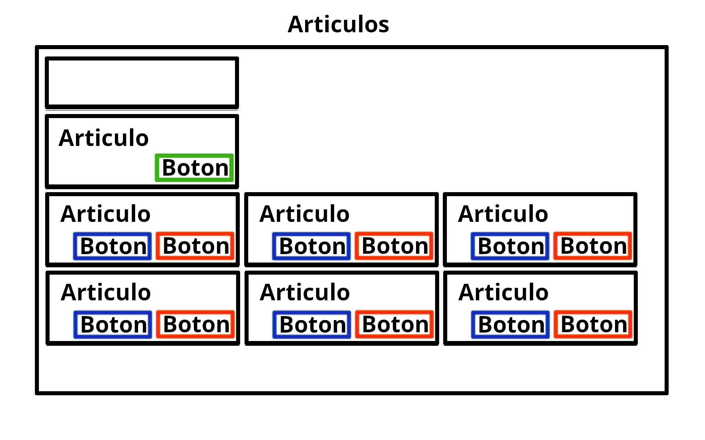
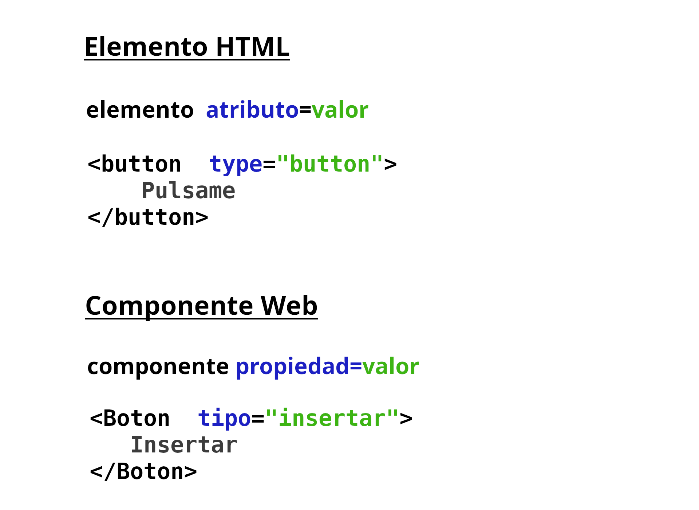

# FRONTEND (con Svelte)

> **ESTE MINITUTORIAL ES UNA VERSIÓN RESUMIDA DEL FRONTEND DE ESTA APLICACIÓN**
> 
> Demo desplegada en [now.sh](https://tiendafrontend.now.sh). Dashboard en [Vercel.com](https://vercel.com/dashboard)
>
>
> **El código actual de la rama master es EXPERIMENTAL**. Este código puede desplegarse en un servidor local, pero los servidores de contenido estático (vercel, netlify, ...) aún no están preparados para su despliegue.
>
> A tener en cuenta:
>
> - Mucho del código que aparece en este minitutorial está simplificado con fines didácticos.
> - El código fuente está disponible en https://github.com/jamj2000/tiendafrontend/tree/next
> - **La parte backend de esta aplicación puede verse en [tiendabackend](https://github.com/jamj2000/tiendabackend)**


## Introducción

Actualmente (año 2020), en el mundo del desarrollo web se vive una efervescencia de nuevas tecnologías. 

Como base tenemos a los 3 pilares fundamentales:

- **HTML 5**
- **CSS 3**
- **Javascript (EcmaScript 6)**

Son lenguajes que todo desarrollador web debería conocer con cierta soltura.

Tanto HTML 5 como CSS 3 han crecido mucho y actualmente cada uno de estos estándares se organizada en distintas partes. 

En cuanto a Javascript, es a partir de 2015 (estándar ECMAScript 6), que  llegó con un montón de nuevas características después de muchos años de indefinición, cuando ha resurgido un gran interés por este lenguaje, ya no sólo para desarrollo de scripts web, sino también como lenguaje a tener en cuenta para el desarrollo de aplicaciones. Esta tendencia se ha visto reforzada por dos circunstancias:

- El uso de Javascript fuera del navegador, a través del entorno de ejecución **node.js**.
- La innumerable cantidad de **bibliotecas/frameworks** que han ido surgiendo.

Javascript sigue evolucionando y dicho estándar se va actualizando cada año. Este año 2020 saldrá el ECMAScript 11, actualmente llamado ES.Next. Sin embargo, estas nuevas versiones sólo añaden características menores. El cuerpo principal de Javascript está en la versión indicada más arriba, también conocida como ES6.

## ¿Qué es **svelte**?

> Eramos pocos, y parió la abuela.

Existen muchas bibliotecas y frameworks para desarrollo en Javascript, tanto para su uso en el **backend** con node.js, como en el **frontend**.

En cuanto al **frontend**, tenemos a **Angular**, **React** y **Vue** como las bibliotecas/frameworks más usadas/os. 

El desarrollo de frontend está muy publicitado y la necesidad de dicho tipo de desarrolladores es manifiesta. Independientemente de framework usado, parece haber una convergencia y acuerdo entre ellos: **todos realizadan desarrollo por componentes web**.

Un **componente web** es una **parte de una aplicación web que encapsula código HTML, CSS y JavaScript**, de forma que no puede ser afectado por el código de la página que lo incluye, salvo que usemos los mecanismos establecidos a tal efecto. Por tanto permiten la reutilización y encapsulación de código cliente.

Svelte es un **compilador** (también puede calificarse como framework), que toma muchas ideas prestadas de los frameworks anteriores, sobre todo de React. Sin embargo hay una característica que lo diferencia de los anteriores: 

- Svelte **realiza una compilación** de nuestro código, convirtiendo sus componentes en código imperativo altamente eficiente.

Proporcionando las siguientes ventajas:

- Tenemos que escribir mucho menos código frente a otros frameworks.
- El código final se ejecuta de forma muy eficiente y rápida.
- El peso (cantidad de KB) de la aplicación final es muy pequeño.
- Facilita la programación reactiva.

Un ventaja añadida es que su sintaxis es más simple, lo cual hace que su curva de aprendizaje sea menos pronunciada que la de otros frameworks. Por este motivo es un buen candidato para su uso con fines didácticos.


## Inicio de un proyecto de svelte@next

Para iniciar un proyecto de svelte@next, ejecutamos:

```console
mkdir  nombre-proyecto  &&  cd  nombre-proyecto
npm  init  svelte@next
git  init
```

> Nota: Sustituimos *nombre-proyecto* por el nombre concreto que queramos dar.

Svelte requiere de muy poco almacenamiento. **Son sólo unos pocos KB**.

> Nota: Como comparación frente a otros frameworks ...
>
> - **Vue**
>   - ```npx  @vue/cli  create  nombre-proyecto   # Unos 100MB aprox.```
> - **React**
>   - ```npx  create-react-app  nombre-proyecto   # Unos 200MB aprox.```
> - **Angular**
>   - ```npx  @angular/cli new  nombre-proyecto   # Unos 300MB aprox.```


## Examinar el proyecto creado

Para ver todo el contenido podemos ejecutar el comando `tree -a  -I .git`:

```
.
├── .gitignore
├── package.json
├── README.md
├── snowpack.config.js
├── src
│   ├── app.html
│   ├── components
│   │   └── Counter.svelte
│   └── routes
│       └── index.svelte
├── static
│   ├── favicon.ico
│   └── robots.txt
└── svelte.config.js
```

El archivo `package.json` es el archivo de gestión de proyecto y dependencias. En él. podremos editar el nombre del autor, la versión, el tipo de licencia, etc.

El archivo `README.md` puede eliminarse o podemos editarlo a nuestro gusto. No es necesario para el funcionamiento de la aplicación, aunque pudiera ser interesante para fines de documentación.

El archivo `snowpack.config.js` contiene la configuración del empaquetador, que en este caso es **Snowpack**. Otros frameworks utilizan otros empaquetadores como Webpack o Parcel. No debemos borrar este archivo. Tampoco lo editaremos, por ahora.

Finalmente, la carpeta `src` va a contener **nuestro código y todos los componentes web que vayamos creando**. Dentro hay 2 subcarpetas:

- **routes**: contiene las rutas
- **components**: contiene los componentes

También hay un archivo `src/app.html` cuyo código es el siguiente:

```html
<!DOCTYPE html>
<html lang="en">
        <head>
                <meta charset="utf-8" />
                <link rel="icon" href="/favicon.ico" />
                <meta name="viewport" content="width=device-width, initial-scale=1" />
                %svelte.head%
        </head>
        <body>
                <div id="svelte">%svelte.body%</div>
        </body>
</html>
```

## Empezar a trabajar en el proyecto


Para ejecutar la aplicación deberemos ejecutar:

```console
npm  run  dev
```

La ejecución del script anterior dará error. El motivo es que no hemos instalado las dependencias que aparecen indicadas en el archivo `package.json`.

Para instalar dichas dependencias, ejecutamos:

```
npm  install
```

Dicho comando, leerá el archivo `package.json`, e instalará todas las dependencias que aparecen ahí en el directorio `node_modules`. Ahora ya podemos volver a ejecutar `npm  run  dev`.

Podrás ver la aplicación en [localhost:3000](http://localhost:3000).


## Simplificando antes de comenzar

El archivo `src/components/Counter.svelte` contiene código de ejemplo. En nuestra aplicación no es necesario. Por tanto lo eliminaremos:

```bash
rm  src/components/Counter.svelte
```

## Definiendo las rutas

En el directorio **`src/routes`** crearemos 4 archivos:

- **$layout.svelte**
- **index.svelte** 
- **articulos.svelte**
- **clientes.svelte**


El archivo **$layout.svelte** define la disposición de nuestra aplicación.

```html
<script>
    import Nav from '$components/Nav.svelte';
</script>

<main>
  <Nav />
  <slot></slot>   <!-- IMPORTANTE -->

  <!-- ... ver código fuente en GitHub  -->
</main>

<style>
  /* ... ver código fuente en GitHub */
</style>
```

El archivo **index.svelte** tiene el siguiente contenido:

```html
<script>
  import Inicio from '$components/Inicio.svelte';
</script>

<Inicio />
```

El archivo **articulos.svelte** tiene el siguiente contenido:

```html
<script>
  import Articulos from '$components/Articulos.svelte';
</script>

<Articulos />
```

El archivo **clientes.svelte** tiene el siguiente contenido:

```html
<script>
  import Clientes from '$components/Clientes.svelte';
</script>
  
<Clientes />
```


## Definiendo los componentes

Los componentes propiamente dichos están en la carpeta **`src/components`**

Por ejemplo, el archivo **Nav.svelte** contiene la barra de navegación como puede verse a continuación:

```html
<nav>
    <!-- ... ver código fuente en GitHub -->
    <a href="/">🛒 Inicio</a>
    <a href="/articulos">🎁 Artículos</a>
    <a href="/clientes">👥 Clientes</a>
</nav>

<style>
 /* ... ver código fuente en GitHub */
</style>
```

**Todo componente en svelte se nombra con la primera letra en mayúscula y la extensión .svelte.**

Cada componente dispone de 3 secciones:

```html
<script>
  // Código javascript
</script>

<!-- Nuestros elementos HTML y componentes web -->

<style>
  /* Código CSS */
</style>
```

Ninguna sección es obligatoria. El orden es indiferente, aunque se recomienda organizar siguiendo el orden anterior.

En la sección de `script` escribiremos en Javascript la funcionalidad del componente.

En la sección de `style` escribiremos en CSS la presentación del componente.

Y en la sección de `html y componentes web` escribiremos la estructura del componente. Para ello haremos uso de código html y ciertas extensiones de svelte que iremos viendo más adelante.


## Diseñando la disposición (layout)

El código para la disposición de nuestra aplicación está en el archivo **`src/routes/$layout.svelte`**.

```html
<script>
    import { setContext } from "svelte";
    import Nav            from '$components/Nav.svelte';
  
    const URL = {
      articulos :  "https://tiendabackend.herokuapp.com/api/articulos/",
      clientes :   "https://tiendabackend.herokuapp.com/api/clientes/"
    };
  
    setContext("URL", URL);
</script>

<main>
  <Nav />
  <slot></slot>
</main>

<div id="OK">😊</div>
<div id="KO">😟</div>

  
<style>
@import url("https://fonts.googleapis.com/css?family=Aclonica");

:global(body) {
    margin: 0;
    padding: 0;
    display: flex;
    flex-direction: column;
    font-family: "Aclonica";
    font-display: swap;     /* Para mejorar rendimiento en carga inicial */
}

:global(*) {
    margin: 0;
    padding: 0;
}

:global(a:hover) {
    text-decoration: none;
    cursor: pointer;
}

:global(div#OK, div#KO) {
    display: none;
    position: fixed;
    top: 60px;
    right: 0px;
    font-size: 60px;
    background-color: transparent;
}
</style>
```

**En svelte los estilos CSS solamente se aplican al componente donde están definidos y a ningún otro componente, aunque tengan las mismas etiquetas**. Si queremos que una determinada etiqueta html tenga un estilo en todos los componentes usamos la forma `:global(etiqueta) { ... }` en lugar de `etiqueta {}` 


## Componentes principales

Los 3 componentes principales son:

- **Inicio**
- **Artículos**
- **Clientes**

**`src/components/Inicio.svelte`**

```html
<style>
  /* Aquí el código CSS */
  /* Consultar el código fuente */
</style>

<h1>Tienda PWA</h1>
  <!-- Se eliminan etiquetas html para resaltar lo esencial -->
  <!-- Consulta el código fuente. --> 
```

Este componente mostrará información acerca de la aplicación. Sólo posee código HTML y CSS. No necesita solicitar datos al servidor. Por tanto su carga es inmediata, y por este motivo lo mostraremos nada más iniciarse la aplicación. Ello permite una carga inicial de la aplicación instantánea.


**`src/components/Articulos.svelte`**



 ```html
 <script>
  import { onMount, getContext } from "svelte";
  import { jsonData }            from "./store.js";

  import Buscar                  from "./Buscar.svelte";
  import Articulo                from "./Articulo.svelte";
  import Boton                   from "./Boton.svelte";

  const URL = getContext("URL");

  let busqueda = "";
  let articulo = {};

  onMount(async () => {
    const response = await fetch(URL.articulos);
    const data = await response.json();
    $jsonData = data;
  });

  $: regex = new RegExp(busqueda, "i");
  $: datos = busqueda 
    ? $jsonData.filter(item => regex.test(item.nombre))
    : $jsonData;

</script>

<style>
  .container {
    display: flex;
    flex-direction: row;
    align-items: center;
    justify-content: left;
    flex-wrap: wrap;
  }
</style>

<h1>ARTÍCULOS</h1>
<Buscar bind:busqueda />

<div class="container">
  <Articulo bind:articulo>
    <div style="text-align: right">
      <Boton documento={articulo} tipo="insertar" coleccion="articulos" />
    </div>
  </Articulo>
</div>

<div class="container">
  {#each datos as articulo}
    <Articulo {articulo}>
      <div style="text-align: right">
        <Boton documento={articulo} tipo="modificar" coleccion="articulos" />
        <Boton documento={articulo} tipo="eliminar"  coleccion="articulos" />
      </div>
    </Articulo>
  {/each}
</div>
```


**`src/components/Clientes.svelte`**


```html
<script>
  import { onMount, getContext } from "svelte";
  import { jsonData }            from "./store.js";

  import Buscar                  from "./Buscar.svelte";
  import Cliente                 from "./Cliente.svelte";
  import Boton                   from "./Boton.svelte";

  const URL = getContext("URL");

  let busqueda = "";
  let cliente = {};

  onMount(async () => {
    const response = await fetch(URL.clientes);
    const data = await response.json();
    $jsonData = data;
  });

  $: regex = new RegExp(busqueda, "i");
  $: datos = busqueda 
    ? $jsonData.filter(item => regex.test(item.nombre))
    : $jsonData;

</script>

<style>
  .container {
    display: flex;
    flex-direction: row;
    align-items: center;
    justify-content: left;
    flex-wrap: wrap;
  }
</style>

<h1>CLIENTES</h1>
<Buscar bind:busqueda />

<div class="container">
  <Cliente bind:cliente>
    <div style="text-align: right">
      <Boton documento={cliente} tipo="insertar" coleccion="clientes" />
    </div>
  </Cliente>
</div>

<div class="container">
  {#each datos as cliente}
    <Cliente {cliente}>
      <div style="text-align: right">
        <Boton documento={cliente} tipo="modificar" coleccion="clientes" />
        <Boton documento={cliente} tipo="eliminar" coleccion="clientes" />
      </div>
    </Cliente>
  {/each}
</div>
```


## Otros componentes

**`src/components/Articulo.svelte`**

```html
<script>
  export let articulo = {};
</script>

<style>
   /* Aquí el código CSS */
  /* Consultar el código fuente */
</style>

<div class="card">
  <input bind:value={articulo.nombre} class="title" />
  <input
    type="number"
    min="0"
    max="9999.99"
    step=".01"
    bind:value={articulo.precio} />  €
  <slot />
</div>
```

**`src/components/Cliente.svelte`**

```html
<script>
  export let cliente = {};
</script>

<style>
  /* Aquí el código CSS */
  /* Consultar el código fuente */
</style>

<div class="card">
  <input bind:value={cliente.nombre} class="title" />
  <input bind:value={cliente.apellidos} class="title" />
  <slot />
</div>
```

**`src/components/Boton.svelte`**


```html
<script>
  import { onMount, getContext } from "svelte";
  import { jsonData }            from "./store.js";

  export let tipo = "insertar";        // insertar, modificar, eliminar
  export let coleccion = "articulos";  // articulos, clientes
  export let documento = {};
  
 
  let handler = () => {};  
  let clases = "";
  let url = "";

  const URL = getContext("URL"); 

  onMount(() => {
    switch (tipo) {
      case "insertar":
        handler = insertar;
        clases = "btn btn-insertar";
        break;
      case "modificar":
        handler = modificar;
        clases = "btn btn-modificar";
        break;
      case "eliminar":
        handler = eliminar;
        clases = "btn btn-eliminar";
        break;
      default:
    }

    switch (coleccion) {
      case "articulos": url=URL.articulos; break;
      case "clientes": url=URL.clientes; break;
      default:
    }
  });

  function insertar() {
    // Aquí código Javascript
    // Consultar el código fuente
  }

  function modificar() {
    // Aquí código Javascript
    // Consultar el código fuente
  }

  function eliminar() {
    // Aquí código Javascript
    // Consultar el código fuente
  }

  // Aquí código Javascript
  // Consultar el código fuente
</script>

<style>
  /* Aquí el código CSS */
  /* Consultar el código fuente */
</style>

<button class={clases} on:click={handler} />
```

**`svelte/components/Buscar.svelte`**

```html
<script>
  export let busqueda;
</script>

<label>
  Buscar
  <input bind:value={busqueda} type="search" />
</label>
```

> **NOTA:** En svelte, cuando una variable tiene antepuesta la palabra `export` significa que a dicha variable (en este caso se le llama propiedad) puede pasársele un valor desde el componente que está encima en la jerarquía, es decir desde el componente padre.


### Similitud entre *elementos html* y *componentes web*




## Comunicación entre componentes

Existen 3 mecanismos:

- Propiedades
- Contextos
- Almacenes


### Propiedades (props)

- Permiten comunicación ***padre-hijo*** únicamente.
- Permiten comunicación ***arriba-abajo*** y ***abajo-arriba***.
- Permiten comunicación ***lectura-escritura***.

#### Ejemplo

**`Articulos.svelte`**
```html
<script>
    let texto = "camisa";
</script>

<Buscar busqueda={texto} />
```

**`Buscar.svelte`**

```html
<script>
  export let busqueda;
</script>

<label>
  Buscar
  <input bind:value={busqueda} type="search" />
</label>
```

Desde el componente padre `Articulos` pasamos el valor `camisa` a la propiedad `busqueda` del componente `Buscar`.

Por defecto, el sentido de la comunicación es Padre->Hijo. 

Si deseamos que el hijo (`Buscar`) pueda pasar información al padre (`Articulos`) haremos uso de la directiva **`bind`** en el componente padre, que quedaría así:

```html
<script>
    let texto = "camisa";
</script>

<Buscar bind:busqueda={texto} />
```

El valor de la propiedad `busqueda`, que será modificada desde el componente `Buscar`, "subirá" hasta la variable `texto` del componente `Articulos`.


### Contextos (setContext / getContext)

- Permiten comunicación ***padre-cualquier_descendiente***.
- Permiten comunicación ***arriba-abajo*** únicamente.
- Permiten comunicación ***lectura*** únicamente.


#### Ejemplo

**`src/routes/$layout.svelte`**

```html
<script>
    import { setContext } from "svelte";
    import Nav            from '$components/Nav.svelte';
  
    const URL = {
      articulos :  "https://tiendabackend.herokuapp.com/api/articulos/",
      clientes :   "https://tiendabackend.herokuapp.com/api/clientes/"
    };
  
    setContext("URL", URL);
</script>
```

**`src/components/Boton.svelte`**

```html
<script>
  import { getContext } from "svelte";
	
  const URL = getContext("URL");
	
  function obtener() {
      fetch(URL.articulos, { method: "GET" })
      .then(res => res.json())
      .then(data => {  /* código para éxito */ })
      .catch(err => {  /* código para error */ });
  }
</script>
```

### Almacenes (stores)

- Permiten comunicación ***componente-componente*** independientemente de su jerarquía.
- Permiten comunicación ***arriba-abajo*** y ***abajo-arriba***.
- Permiten comunicación ***lectura-escritura***.


#### Ejemplo

**`src/components/store.js`**

 ```javascript
import { writable } from 'svelte/store';

export const jsonData = writable([]);
```

Declaramos en `store.js` un array vacío, que contendrá datos en formato JSON.


**`src/components/Articulos.svelte`**

```html
<script>
 import { jsonData }   from "./store.js";
	
 onMount(async () => {
    const response = await fetch( URL.articulos );
    const data = await response.json();
    $jsonData = data;
  });
</script>	
```

En el componente `Articulos.svelte` hacemos una petición **fetch** al servidor y guardamos los datos en formato JSON en la variable jsonData del almacén. 

**Nota:** Observa que para referirnos a la variable del almacén lo hacemos como **$jsonData**.


**`src/components/Boton.svelte`**

```html
<script>
  import { jsonData }   from "./store.js";
  export let documento = {};
	
  function insertar() {
      fetch(URL.articulos, {
        method: "POST",
        headers: { "Content-Type": "application/json" },
        body: JSON.stringify(documento)
      })
        .then(res => res.json())
        .then(data => { 
	  $jsonData = [...$jsonData, data];
          ok();
        })
        .catch(err => ko());
  }
	
</script>
```

En el componente `Boton.svelte` insertamos un nuevo artículo en el servidor mediante una petición **fetch** de tipo POST. Si se guarda correctamente en el servidor, entonces actualizamos en consecuencia nuestra variable jsonData del almacén:

**`$jsonData = [...$jsonData, data]`**

**Nota:** Observa de nuevo que para referirnos a la variable del almacén lo hacemos como **$jsonData**.


## Construir la aplicación para el entorno de producción

Para crear una versión optimizada de la aplicación, ejecutamos:

```bash
npm  run  build
```

Puedes ejecutar la aplicación recién creada con `npm run start`. 


## Single-Page App

**Esta es una aplicación de página única (SPA)**.


## Despliegue en la web

**AVISO: A día de hoy, los servidores que se proponen más abajo sólo soportan la versión anterior de Svelte. Por tanto, el despliegue en ellos de svelte@next no es posible por ahora.**

Este frontend no contiene código de servidor, es decir, no contiene código para backend. Por tanto podemos desplegarlo como hariamos con cualquier página html. Cualquier sitio que permita **contenido estático** nos vale. 

Existen muchos sitios que ofrecen esta opción, Por ejemplo:

- GitHub Pages
- Netlify
- Now (de [Vercel.com](https://vercel.com) )
- Surge

Para desarrolladores con poca experiencia, la forma más sencilla de despliegue es utilizar la interfaz web que proporcionan dichos sitios. 

Pero si deseas realizar el despliegue mediante interfaz de texto, a continuación se muestra un resumen de cómo se realizaría con Vercel y con Surge.


**Con [vercel](https://vercel.com)**

Instala `vercel` si aún no lo has hecho:

```bash
npm install -g vercel
```

Luego, desde la carpeta de tu proyecto:

```bash
vercel  login
vercel  --prod
```

> NOTA: Sustituye *my-project* por el nombre de tu proyecto.


**Con [surge](https://surge.sh/)**

Instala `surge` si aún no lo has hecho:

```bash
npm install -g surge
```

Luego, desde la carpeta de tu proyecto:

```bash
npm  run  build
surge  public  my-project.surge.sh
```

> NOTA: Sustituye *my-project* por el nombre de tu proyecto.


## Progressive Web Application

**Esta es una aplicación web progresiva (PWA)**.

La tecnología PWA es relativamente nueva, iniciandose en el año 2015 bajo el auspicio de **Google**.

Dicha tecnología pretende, mediante la aplicación de pequeñas adaptaciones, usar las **tecnologías web (HTML + CSS + Javascript)** para el **desarrollo de aplicaciones de escritorio y móviles**.

Como el lector entendido en el asunto comprenderá rápidamente, las implicaciones de tal tecnología son enormes:

- **Desarrollo para web, para escritorio y para móvil. Todo en uno.**
- **Simplificación del desarrollo**. 
  - "No es necesario" aprender lenguajes como Java o Swift.
  - "No es necesario" desarrollar de forma nativa (SDKs para Android e iOS).
  - "No es necesario" desarrollar de forma híbrida (Frameworks Cordova, React Native, Angular Ionic. Electron para el escritorio)
- **Uso de Web APIs**, las cuales [son bastantes, muchas de ellas aún en desarrollo](https://developer.mozilla.org/en-US/docs/Web/API): fetch, websockets, geolocalización, audio, speech, ... 
 

**Requisitos para considerar progresiva a una aplicación web**

Una PWA debe cumplir, en esencia, 2 requisitos:

- Debe servirse desde un servidor **HTTPS**. Excepción: `localhost`.
- Debe disponer de un archivo **manifest.json** o similar con metadata de la applicación.
- Debe tener capacidad de funcionar **offline**. Para ello es necesario disponer de un *Service Worker*.


**AVISO: Esta documentación que aparece a continuación necesita ser revisada. Por ahora no es fiable.** 

Los archivos necesarios para hacer que una aplicación web sea progresiva son:

- `static/manifest.json` 
- `static/images/icons/*`  
- `static/service-worker.js`   

Tanto el archivo `manifest.json` como la carpeta `images` y todos sus iconos, podemos generarlos de manera sencilla con [Web App Manifest Generator](https://app-manifest.firebaseapp.com/).

El archivo `service-worker.js` se encarga de funcionar como intermediario entre nuestro frontend y el backend, y tiene la siguiente apariencia:

```javascript
//------  Este código está simplificado para resaltar la estructura
//------  Para ver todo el código consulta el archivo correspondiente
const CACHE_NAME = 'tiendafrontend-v1';

// Archivos necesarios para el funcionamiento offline
const CACHE_ASSETS = [
  '/',
  '/index.html',
  '/offline.html',
  '/favicon.png'
];

// INSTALL
// Realizamos el cacheo de la APP SHELL
self.addEventListener('install', funcionDeInstalacion);


// ACTIVATE
// Eliminamos cachés antiguas.
self.addEventListener('activate', funcionDeActivacion);


// FETCH
// Hacemos peticiones a recursos.
self.addEventListener('fetch', funcionDeFetch);


// PUSH
self.addEventListener('push', funcionDePush);
```

El código fuente completo puede verse en [public/service-worker.js](./public/service-worker.js)

Además de todo lo anterior, deberemos modificar el archivo **`index.html`** para que aparezcan las siguientes líneas:

```html
<!DOCTYPE html>
<html lang="es">
<head>
  <!-- Se eliminan etiquetas html para resaltar lo esencial -->
  <!-- Consulta el código fuente. --> 

	<link rel="icon" type="image/png" href="/favicon.png">
  
	<!-- PWA: Para habilitar Progressive Web Application -->
	<link rel="manifest" href="manifest.json">  <!--                  IMPORTANTE -->
  
	<!-- PWA: Añadir a pantalla de inicio para Safari en iOS -->
	<meta name="apple-mobile-web-app-capable" content="yes">
	<meta name="apple-mobile-web-app-status-bar-style" content="black">
	<meta name="apple-mobile-web-app-title" content="Tienda">
	<link rel="apple-touch-icon" sizes="152x152" href="/images/icons/icon-152x152.png">
	<meta name="msapplication-TileImage" content="/images/icons/icon-144x144.png">
	<meta name="msapplication-TileColor" content="#fdebc9">
  
  <!-- Chrome, Firefox OS and Opera -->
  <meta name="theme-color" content="#fdebc9">

  <!-- Se eliminan etiquetas html para resaltar lo esencial -->
  <!-- Consulta el código fuente. --> 
</head>

<body>
	<noscript>
		<p> Este sitio necesita Javascript para funcionar. </p>
	</noscript>
	<script>
		// Si está soportado serviceWorker por el navegador
		if ('serviceWorker' in navigator) {
		  window.addEventListener('load', () => {
			navigator.serviceWorker
			  .register('./service-worker.js')
			  .then(reg => console.log('[Service Worker] * Registrado.'))
			  .catch(err => console.log(`[Service Worker] * Error: ${err}`));
		  });
		}
	  </script>
	
	  <script src="service-worker.js"></script> <!-- Gestión de eventos del ServiceWorker -->
</body>
</html>
```

Lo que hacemos es **añadir un enlace al archivo `manifest.json`** e indicar los iconos y colores que usaremos.

Además en el `body` de la página, registramos el `service-worker.js` y lo cargamos.

El código fuente completo puede verse en [public/index.html](./public/index.html)

Por último, es recomendable tener un archivo llamado *`offline.html`* o similar, que mostraremos cuando no haya conexión. 

```html
<!DOCTYPE html>
<html lang="es">
<head>
</head>
  <!-- Se eliminan etiquetas html para resaltar lo esencial -->
  <!-- Consulta el código fuente. --> 
<body>
    Estamos sin conexión
    
    <script>
        // Este código detecta cuando volvemos a tener conexión
        // y en ese caso se carga automáticamente la página principal.
        // El usuario no necesita refrescar la página.
        window.addEventListener("online", () => (window.location.href = "/"));
    </script>
</body>
</html>
```

## Auditoría de la aplicación

Podemos realizar una auditoría de la aplicación, haciendo uso de la extensión **Lighthouse** de Chrome. Para instalar dicha extensión en el navegador chrome escribimos la URL chrome://extensions/.

Si pulsamos la tecla `F12` para mostrar las `Dev Tools` podremos ver una pestaña con el nombre `Audits`. Desde ahí realizaremos la auditoría.


> NOTA: Algunas extensiones activas en el navegador pueden ralentizar las pruebas y provocar que el *score* obtenido sea menor. Para evitar esto podemos lanzar la auditoría desde el `modo incógnito` del navegador o, una solución más drástica, desactivar las extensiones.


## Referencias

- [Tutorial y Ejemplos](https://svelte.dev/)
- [Componentes Svelte](https://madewithsvelte.com/ui-library)
- [Chat en Discord](https://svelte.dev/chat)
